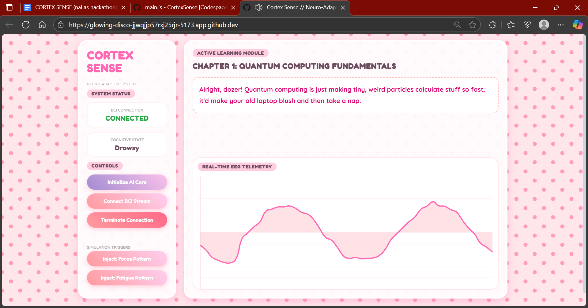

#  Cortex Sense: The Neuro-Adaptive Learning Assistant
> **"The first EdTech platform that knows when you're tired and wakes you up with AI."**



##  What is Cortex Sense?
Online learning is broken. It treats everyone the same, whether they are hyper-focused or falling asleep.

**Cortex Sense** is a **Neuro-Adaptive Web Application** that uses a simulated Brain-Computer Interface (BCI) to monitor cognitive states in real-time. It uses **Generative AI** and **Audio Bio-Feedback** to actively intervene when a student loses focus.

It’s not just a website; it’s a study partner that adapts to *your* brain.

---

##  Key Features ( The "Magic" )

### 1.  Generative AI Intervention (Google Gemini 2.5)
When the system detects the **"Drowsy"** state, it doesn't just alert you. It captures the complex academic text on the screen and sends it to **Google Gemini 2.5 Flash**. The AI instantly **rewrites the lesson** into a funny, short, one-sentence summary to re-engage the user.

### 2.  Neuro-Audio Bio-Feedback
We utilize the **Web Audio API** to influence brainwaves directly:
* **Focused State:** Plays a subtle **40Hz Gamma Binaural Beat** to biologically sustain concentration.
* **Drowsy State:** Triggers a sharp auditory alert to snap the user back to attention.

### 3.  Client-Side Neural Network
Using **Brain.js**, we run a Long Short-Term Memory (LSTM) Neural Network entirely in the browser. It analyzes the simulated EEG data stream (Alpha vs. Theta waves) to classify cognitive states with zero latency.

### 4.  Aesthetic Interface
Who says AI has to be boring? We implemented a custom **Glassmorphism Kawaii UI** with responsive charts, glowing visuals, and a user-friendly experience that reduces anxiety during learning.

---

##  The Tech Stack

* **Core Framework:** Vite (Vanilla JS)
* **AI & ML:** Brain.js (Neural Network), Google Generative AI SDK (Gemini 2.5)
* **Visualization:** Chart.js (Real-time EEG Telemetry)
* **Audio:** Native Web Audio API (Binaural Oscillators)
* **Styling:** Custom CSS3 (Glassmorphism & Animations)

---

##  How to Run This Project

Since this uses modern AI features, you need to set up the environment variables.

### Prerequisites
* Node.js installed
* A free Google Gemini API Key

### Installation

1.  **Clone the repo**
    ```bash
    git clone [https://github.com/shahirun-x/CortexSense.git](https://github.com/shahirun-x/CortexSense.git)
    cd CortexSense
    ```

2.  **Install Dependencies**
    ```bash
    npm install
    ```

3.  **Setup Security Keys**
    Create a file named `.env` in the root directory and add your Gemini Key:
    ```env
    VITE_GEMINI_API_KEY=your_actual_google_api_key_here
    ```

4.  **Run the App**
    ```bash
    npm start
    ```
    Open your browser to the local host link (usually `http://localhost:5173`).

---

##  How to Demo (The Hackathon Flow)

1.  **Initialize AI Core:** Click the purple button to train the Neural Network in the browser.
2.  **Connect BCI Stream:** Starts the live EEG simulation.
3.  **Inject Focus Pattern:** Observe the chart moving fast (Alpha waves). The text remains detailed. Listen for the 40Hz hum.
4.  **Inject Fatigue Pattern:** Observe the chart slowing down (Theta waves).
    * **Watch the Magic:** The text effectively *morphs* into a funny summary (thanks to Gemini).
    * **Hear the Alert:** The focus music stops and a wake-up sound plays.

---

##  Privacy & Architecture
Unlike other BCI apps, Cortex Sense processes the neural data **locally** using `Brain.js`. Your brain data never leaves the browser. Only the text content is sent to Google Gemini for simplification.

---
